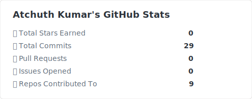
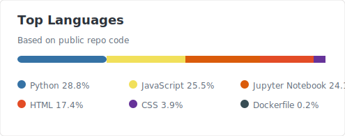

&nbsp;

&nbsp;

---

## About me

I build things end-to-end — Django backends, REST APIs, and AI agents that actually do useful work. Currently focused on **LLM-powered applications**, **agentic workflows**, and **RAG pipelines**.

Fresher actively looking for remote roles and freelance projects. I move fast, read docs carefully, and don't stop until it works.

- 📍 Chittoor, India — open to remote work globally
- 🔭 Currently building: AI document Q&A agent with LangChain + FAISS
- 🌱 Learning: FastAPI · LangGraph · production ML deployment
- 💬 Ask me about: Python, Django, LangChain, building AI agents
- 📫 Reach me: **budireddyatchuthkumar@gmail.com**

---

## Tech stack

**Languages & Frameworks**

**AI / ML / GenAI**

**Databases & Tools**

---

## Projects

### 🏠 UrbanHome — Real Estate Marketplace
> Full-stack Django web app for buying, selling, and renting properties

Built user authentication, property CRUD, messaging between buyers & sellers, favorites, reviews & ratings, and advanced multi-filter search. Structured as a multi-app Django project with Bootstrap 5 frontend.

**Stack:** `Python` `Django` `Bootstrap 5` `SQLite` `AJAX` `JavaScript`

---

### 🤖 AI Document Q&A Agent *(In Progress)*
> Ask natural language questions against your own PDFs using RAG

RAG pipeline: PDF ingestion → chunking → FAISS vector store → LangChain QA chain → conversational interface.

**Stack:** `Python` `LangChain` `FAISS` `OpenAI API` `FastAPI`

---

## GitHub stats

<!--
  STATS SETUP INSTRUCTIONS
  ─────────────────────────────────────────────────────────────────────────────
  These images are generated by your OWN GitHub Action (no external service).
  
  ONE-TIME SETUP (takes 5 minutes):
  1. In this repo (BUDIREDDYATCHUTHKUMAR), go to Settings → Actions → General
     → set "Workflow permissions" to "Read and write permissions" → Save
  2. Go to github.com/settings/tokens → Generate new token (classic)
     → No scopes needed → copy the token
  3. In this repo → Settings → Secrets and variables → Actions → New secret
     → Name: GH_TOKEN   Value: [paste your token] → Save
  4. Create the file .github/workflows/stats.yml in this repo
     (copy the YAML from the stats.yml file included alongside this README)
  5. Go to Actions tab → run the workflow manually once
  6. The images will appear at: ./generated/overview.svg and ./generated/languages.svg
  ─────────────────────────────────────────────────────────────────────────────
  After setup, uncomment the lines below and delete this comment block.
-->

<!--

&nbsp;&nbsp;

-->

<!-- STREAK: use streak-stats.demolab.com (DenverCoder1's hosted version - more reliable than the original) -->

---

## Activity graph

---

## Connect with me

**Open to remote roles and freelance projects in Python, Django, AI/ML, and GenAI.**
If you have something interesting, send an email — I respond fast.

---

Last updated June 2026

